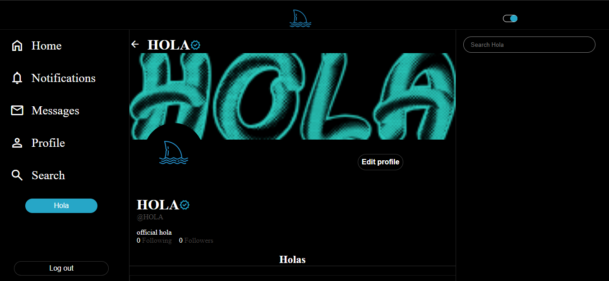

# Hola


## About
A social media app built with MongoDB, GraphQL express, react, NodeJS and more. this is a fully functional and resposnsive app that allows users to create an account, post messages, photos, videos, comment, like/unlike, follow/unfollow, change their avartar and much more. i used graphql aubacrptions to enable instant messaging and cloudinary for picture and videos upload.

## Technologies
project is creted witth:
 * react: "^18.2.0"
 * slick-carousel: "^1.8.1"
 * react-slick: "^0.29.0"
 * css
 * graphql-ws: "^5.10.1"
 * axios: "^0.27.2"
 * @apollo/client: "^3.6.9"
 * cloudinary-react: "^1.8.1"
 * axios: "^0.27.2"
 * graphql-subscriptions: "^2.0.0"
 * subscriptions-transport-ws: "^0.11.0"

## Setup
To run this project, install it locally using npm:

```
$ npm install
$ npm start
```
## Demo
[demo](https://bamidelee.github.io/hola-frontend)


